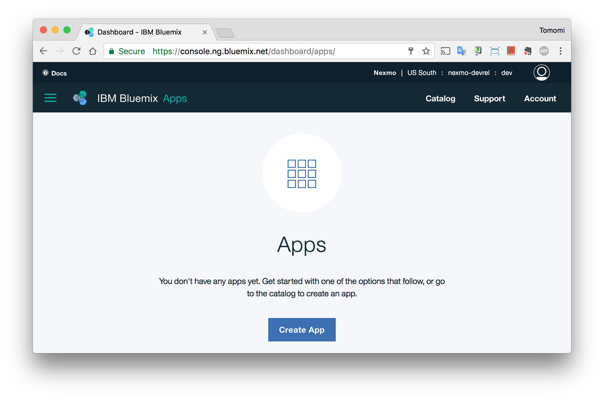
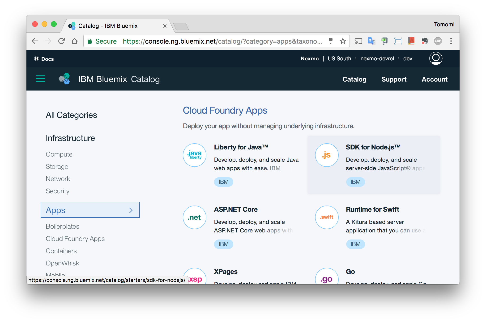
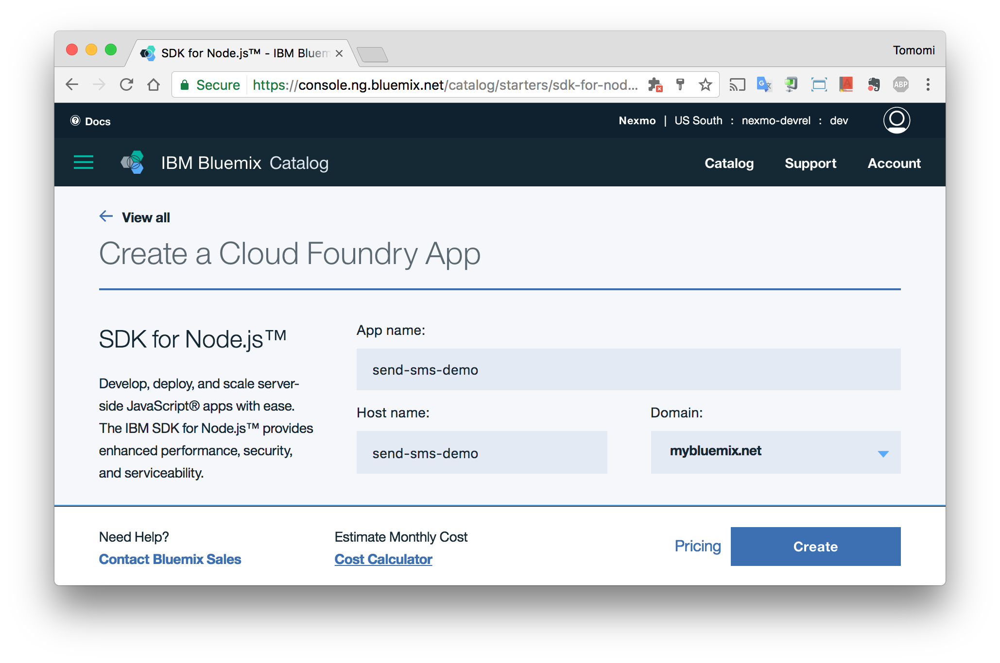
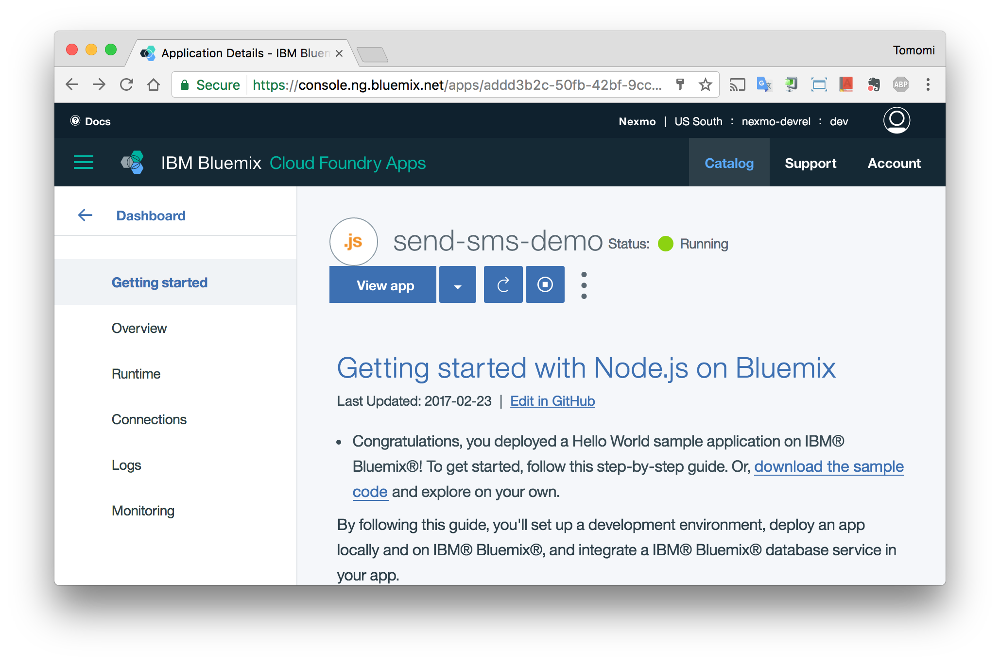
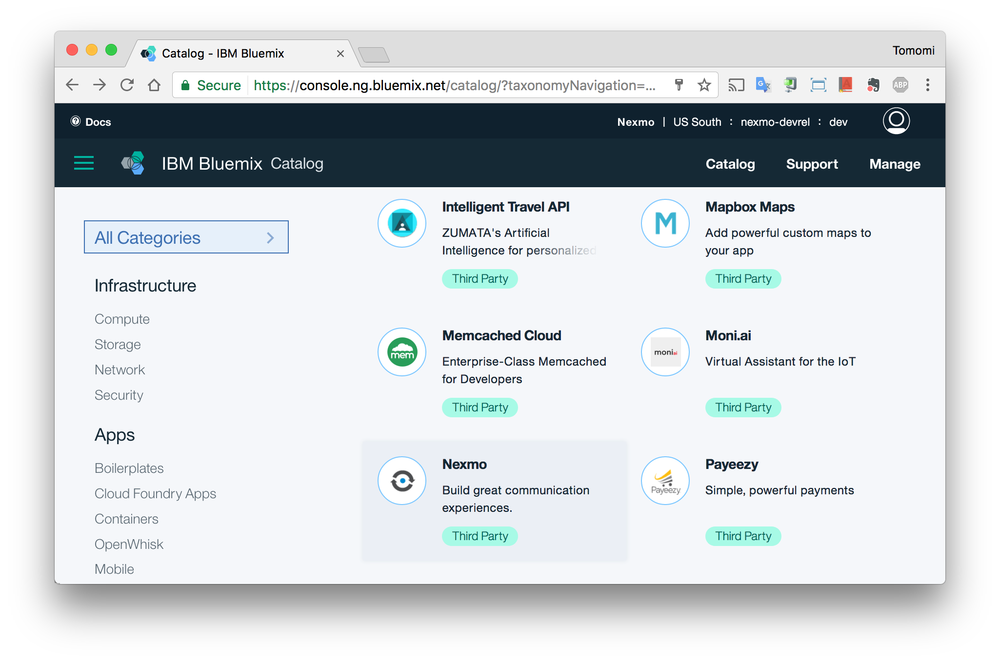
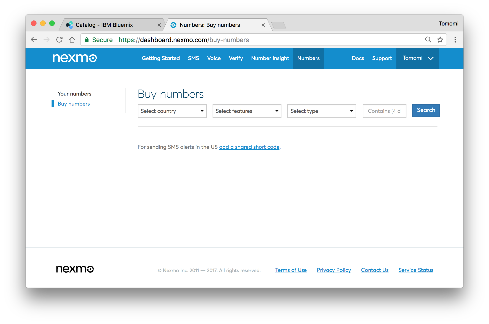
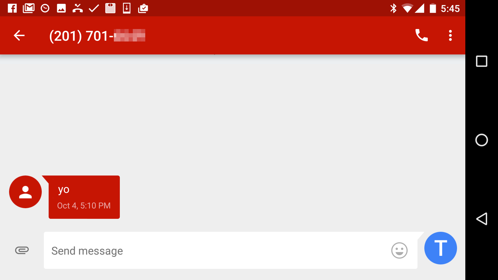

---

copyright:

  years: 2017

lastupdated: "2017-04-04"

---

{:new_window: target="_blank"}
{:shortdesc: .shortdesc}
{:screen:.screen}
{:codeblock:.codeblock}
{:pre: .pre}

# Getting started with Nexmo on Bluemix
{: #gettingstarted}


[Nexmo](https://nexmo.com) provides tools for voice, messaging and phone verification, enabling you to embed programmable communications into mobile apps, websites and business systems. Nexmo APIs include SMS text messaging, two-factor authentication, voice, chat, and social media connect.

To get started with Nexmo APIs on Bluemix:

1. If you don't already have a Nexmo account, [sign up for ](https://dashboard.nexmo.com/sign-up)an account{:new_window}.

2. Login to [Nexmo Dashboard](https://dashboard.nexmo.com/settings){:new_window}. Scroll to the **API Settings** section to get your API credentials. You will need the *API Key* and *API Secret* for this tutorial.


This step-by-step instruction uses Node.js, so you need [Node.js](https://nodejs.org/) installed on your machine. Once you are ready, let’s get started!

## Creating a New Application

Go to your [Dashboard](https://console.eu-gb.bluemix.net/dashboard/apps/), and click the **Create App** button:



Next, scroll down to *Cloud Foundry Apps*, and choose **SDK for Node.js****TM** :



Then, give your new application a unique name. In this tutorial, you are going to build a very simple app that just send an SMS message to your phone number, so let’s name it something like "send-SMS". Then click **Create**:



Now, it takes you to the dashboard and you should see some progress indicators that shows you the new application has been created.

## Using Nexmo with the New Application

You are going to use Nexmo to build your SMS analysis app. Click **Catalog** at the top menu bar:



At the catalog, search under *Mobile*, then click **Nexmo**:



Fill out your Nexmo API Key and API Secret.

[I NEED THE SCREENSHOT!]

Click Create.

### Downloading Your Template Files

Go back to [the application dashboard](https://console.ng.bluemix.net/dashboard/apps/), choose your "send-sms" application, click **Getting Started** from the side menu, then click “*Download the Sample Code*” link to get the zip file, then unzip it. The folder should contain the template code files. Now you are ready to leave the Bluemix dashboard!


## Using the Cloud Foundry Command Line interface

To download, modify, and redeploy your Cloud Foundry applications and service instances, you need to download and install the [Cloud Foundry command line interface](https://www.ng.bluemix.net/docs/#starters/install_cli.html) (CLI).

After the installation, use the `cf` command to login and connect to the Bluemix environment:

```bash

$ cf api [https://api.ng.bluemix.net](https://api.ng.bluemix.net)

```

Or use the API endpoint for your region, [https://api.eu-gb.bluemix.net](https://api.eu-gb.bluemix.net/) (United Kingdom) and [https://api.au-syd.bluemix.net](https://api.au-syd.bluemix.net/) (Sydney).

Then login:

```bash

$ cf login

```

Now you got your Bluemix set up, so you can get started creating your Node.js application.

## Setting up Your Nexmo Phone Number

In this tutorial, we are going to create a very basic app that sends a SMS message from your Nexmo phone number to your mobile phone number.

You can get your own number by going to your [Nexmo dashboard](https://dashboard.nexmo.com/) and click **Numbers** from the top menu bar. Although can purchase any numbers with a country code of your choice, to avoid the international fee, you should choose a number with the same country code with your mobile phone number where you are sending SMS to.



## Using the Nexmo REST API Client for Node.js

Now, let’s code! Make sure that node.js is installed on your machine to start coding.

Take a look at the project folder that you previously downloaded from your Bluemix dashboard. Ot should contains files like this:

```bash
.
├── LICENSE
├── README.md
├── app.js
├── manifest.yml
├── package.json
└── public
    ├── images
    │   └── newapp-icon.png
    ├── index.html
    └── stylesheets
        └── style.css
```

On terminal, ‘cd’ to the project root, then use the `npm` command to install dependencies:

```bash
$ npm install
```

Then install Nexmo Node.js client library:

```bash
$ npm install nexmo --save
```

This will add the `nexmo` as the dependencies in your **package.json** file automatically.

Also, check your **manifest.yml** file, which is used by Bluemix for the deployment. It should look like this:

applications:

```bash
- services:
  - nexmo
  name: send-sms
  command: node app.js
```

Now, open the app.js file, and assign your Nexmo API credentials. You can grab the credentials from the Bluemix, where it stores all service credentials. Access your Nexmo credentials within the `VCAP_SERVICES` environment variable with `cfenv` that parses Cloud Foundry-provided environment variables:

```javascript
const cfenv = require('cfenv');
Const appEnv = cfenv.getAppEnv();
const nexmoApiKey = appEnv.getService('api_key');
Const nexmoApiSecret = appEnv.getService('api_secret');
```

Now, initialize a Nexmo instance with the credentials:

```javascript
const Nexmo = require('nexmo');
const nexmo = new Nexmo({
  apiKey: nexmoApiKey,
  apiSecret: nexmoApiSecret
});
```

### Sending SMS Messages with Node.js


To send a message, use the `nexmo.sms.sendSms` function and pass your virtual number you are sending the message from, a recipient number, and the message to be sent. Also, you can pass [optional params](https://docs.nexmo.com/messaging/sms-api/api-reference#request), and a callback.

For this exercise, let’s simply hard-code a phone number (which should start with a country code, e.g. "15105551234") and a message to try the API:

```javascript
nexmo.message.sendSms(
  YOUR_VIRTUAL_NUMBER, '15105551234', 'yo',
    (err, responseData) => {
      if (err) {
        console.log(err);
      } else {
        console.dir(responseData);
      }
    }
);
```

Let’s run this, and see if you get a SMS to your mobile phone.

```bash
$ node index.js
```



As soon as you run the script, Nexmo will send the message to your phone. The time of the actual delivery depends on your mobile phone carrier, so it can be instant, or it might take some time.

## Deploying Your Application

To deploy your application, you will be using the Cloud Foundry CLI again. You can push your code with `cf push` command:

```bash
$ cf push
```

Once you deploy the application, your phone should receive a message. Sure, this application isn’t the most practical, however, it should provide a good idea of how to use the Nexmo SMS API to build better applications!

To create something more practical using the Nexmo APIs, such as an app to make and receive voice calls; or setting up two-factor authentications, visit the [Nexmo Tutorial Blog](https://www.nexmo.com/blog/category/developers-2/tutorial/)!

<!-- # Related Links moved to toc file for new doc app experience -->
