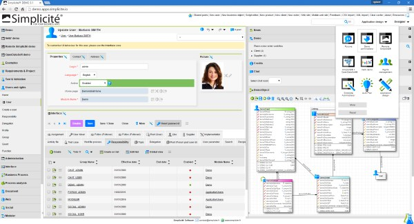

{:new_window: target="_blank"}
{:shortdesc: .shortdesc}
{:screen: .screen}
{:codeblock: .codeblock}
{:pre: .pre}

# Getting started with Simplicit&eacute;
{: #gettingstarted}
*Last updated: 18 may 2016*

**Simplicit&eacute;** is a versatile backend enterprise application platform designed to satisfy
your custom business requirements using web-based business model configuration.

{:shortdesc}



It brings:

* A comprehensive business engine that dynamically processes your business models (objets, workflows, rules, , rights, reporting, ...).
* A full-featured generic web user interface (and its simplified mobile variant).
* Various generic APIs and integration facilities (JSON/REST and XML/SOAP webservices and their wrapper libs, I/O interface, ...).

A Simplicit&eacute; instance can be deployed:

* As a Bluemix service (this is the most straight forward approach, see below)
* As a Bluemix application or as a Docker container running on Bluemix (this is for advanced needs)

When deployed as a Bluemix service it can be bound to any Bluemix application.

The typical usage is when you want to develop a custom frontend application (using Java, PHP, Node.js, ...) that exposes
your business implemented on a Simplicit&eacute; instance using its APIs.

## Deploy a Simplicit&eacute; instance as a Bluemix service

To deploy a service you can use the Bluemix console: go to the service catalog &gt; _Web and applications_ section
and click on the Simplicit&eacute; service and follow the instructions.

You can also use the `cf` CLI:

```
cf create-service simplicite free <service instance name>
```
{: pre}

Then you can bind it to a existing Bluemix application:

```
cf cf bind-service <application name> <service instance name>
```
{: pre}

Once the service is bound to the application, the connection details will be available in the `VCAP_SERVICES` environment variable:

```json
{
  "simplicite": [
    {
      "name": "<service instance name>",
      "label": "<service instance name>",
      "plan": "free",
      "credentials": {
        "baseURL": "<service instance base URL>",
        "port": "80",
        "host": "<service instance host name>"
      }
    }
  ]
}
```
{: codeblock}

Note that there is no username/password in this block, this is normal because defining user profiles and users is part of your
business configuration

Once you have configured such a user you can start calling the Simplicit&eacute; webservices from your application.
Please refer to the [API reference section for details](#api).

Example:

This example is taken from a simple Node.js application that uses the demo business case (see [Samples section](#samples)):

```javascript
var express = require('express');
var app = express();

(...)

var services = JSON.parse(process.env.VCAP_SERVICES || "{}");
var simpliciteService = services.simplicite && services.simplicite.length > 0 ? services.simplicite[0].credentials : null;

if (simpliciteService) {
	var simpliciteApp = require("simplicite").session( {
		host: simpliciteService.host,
		port: simpliciteService.port,
		user: "admin",
		password: "<admin user's password>",
		debug: false
	};);

	var productBusinessObject = simpliciteApp.getBusinessObject("DemoProduct");
	app.get("/products", function(req, res) {
		productBusinessObject.search(undefined, { inlineDocs: true }).then(function(list) {
			res.render("products", { products: JSON.stringify(list), });
		});
	});
}

(...)

app.listen(process.env.VCAP_APP_PORT || 3000, process.env.VCAP_APP_HOST || "localhost");
```
{: codeblock}

You can get the complete example [in this JazzHub repository](https://hub.jazz.net/git/simplicite/simplicite-node)

## Tutorials and Samples
{: #samples}

Here are some sample buisness cases modules that you can import on your Simplicit&eacute;&reg; intances:

* [Sample business cases](https://www.simplicite.io/resources/modules/){:new_window}

You can also have a look at

* [The demo business case in-depth presentation](https://www.simplicite.io/resources/demo.pdf){:new_window}
* [The comprehensive training documentation](https://www.simplicite.io/resources/training/){:new_window}

## API Reference
{: #api}

* [I/O command line interface - CLI](https://www.simplicite.io/resources/documentation/02-integration/io-commandline.md){:new_window}
* [REST webservices API documentation](https://www.simplicite.io/resources/documentation/02-integration/rest-services.md){:new_window}
* [SOAP webservices API documentation](https://www.simplicite.io/resources/documentation/02-integration/soap-services.md){:new_window}
* [RAW webservices API documentation](https://www.simplicite.io/resources/documentation/02-integration/raw-services.md){:new_window}

# Related Links
{: #rellinks}

* [Simplicite.io hub](https://www.simplicite.io){:new_window}
* [Simplicité Software website](https://www.simplicitesoftware.com){:new_window}
* [Documentation index](https://www.simplicite.io/resources/documentation/index.md){:new_window}
* [Tools and contributions (hosted on GitHub)](https://github.com/simplicitesoftware?tab=repositories){:new_window}
